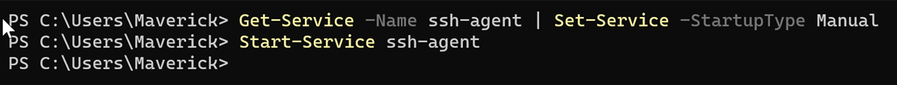
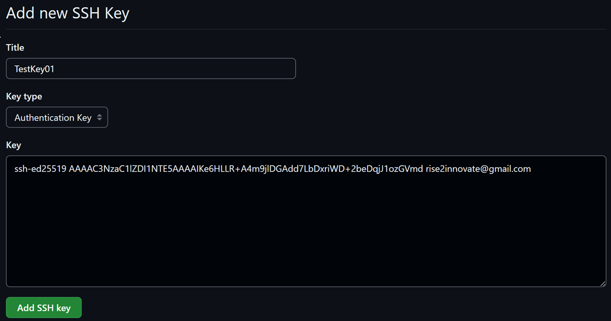
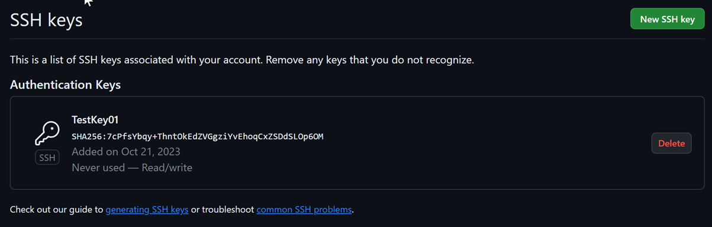
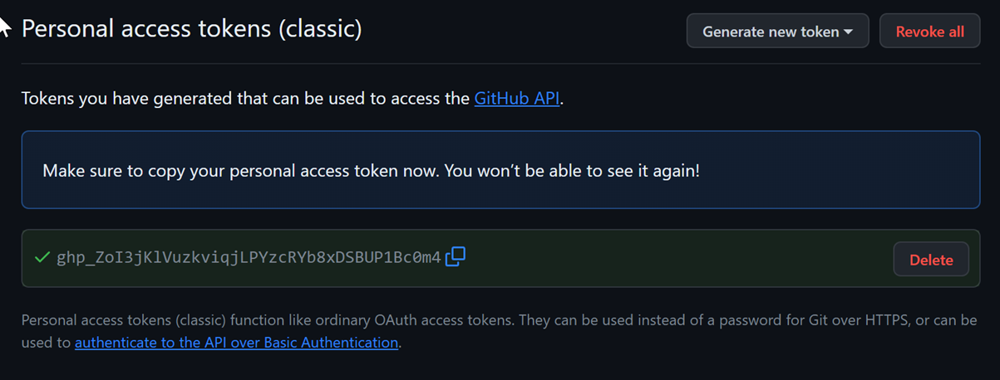
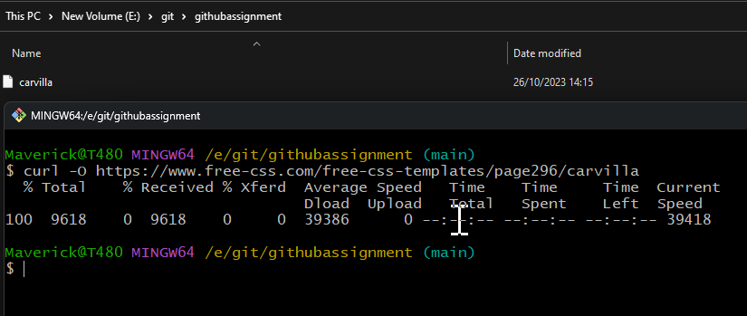
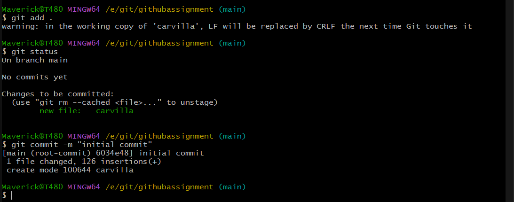

# Git & GitHub Task 20231021


## Tasks List

## Prerequisite
- Create a GitHub account. (Skip, If you have done already) <br>
- Add both of the following ways to authenticate to push to your repositories: <br>
-- **SSH**: generate and add a public/private SSH key pair to GitHub. [GitHub tutorial](https://drive.google.com/file/d/1tL4FvtwaVLio9h1qyQT18EhGyeQ7DNxf/view?usp=share_link) <br>
-- **HTTPS**: generate and save a GitHub token to connect with HTTPS: (We have already learnt and implemented)

### Tasks

1. Install Git or Github Desktop on your PC
2. Download the website from following url in a directory https://www.free-css.com/free-css-templates/page296/carvilla using linux command.
3. Make commit of whole data with name "initial commit"
4. Make remote access of github repository. 
5. Now commit this code to github in a reposity in main branch.
6. Add some changes in your websites (stored in your PC , that was downnladed from https://www.free-css.com/free-css-templates/page296/carvilla)
7. Now again repeat procedure of push to Github so changes can be visible on your repo
8. Clone repo https://github.com/engineerbaz/docker-file.git in /temp/testRepo
9. Make a repo of your own name and make two branches in it as `prod` and `dev`
10. Fork the repository (https://github.com/engineerbaz/DevOps-09-Training/) by clicking on the Fork button on the upper right corner
11. Clone the repository of your fork with: git clone https://github.com/YOURLOGIN/DevOps-09-Training (replace YOURLOGIN with your GitHub login)
12. Create a file of your Task in Markdown language and upload.    
  
    

# Tasks activities and submission

### Prerequisites

1. GitHub account created (rise2innovate) need to addd URL
2. Authentication added   
    #### 1.1 SSH
    
Generating SSH Key:

```bash
ssh-keygen -t ed25519 - C "rise2innovate@gmail.com"
```
#### Output:


Starting SSH Service manually:

```bash
Get-Service ssh-agent
```

#### Output:




Adding new public key to GitHUB:

#### Output:




Verification on Github:

#### Output:




#### 1.2 HTTPS

Generating HTTPS Personal Token:

#### Output:

  

  

### Task1: *Install Git or Github Desktop on your PC*

### Task2: *Download the website from following url in a directory https://www.free-css.com/free-css-templates/page296/carvilla using linux command*

Linux command to download a webpage:

```bash
curl -O https://www.free-css.com/free-css-templates/page296/carvilla
```

#### Output:




### Task3: *Make commit of whole data with name "initial commit"*

```bash
git add .
git status
git commit -m "initial commit"
```

#### Output:



### Task4: *Make remote access of github repository.*

Create a repo on Github:

#### Output:


Check if any other remote repo is connected:

```bash
git remote -v
```

Access you remote repo to local Git:

```bash
git remote add origin https://github.com/rise2innovate/gitassignment.git
```

Validate if the remote repo is now visible"

```bash
git remote -v
```
#### Output:


### Task5: *Now commit this code to github in a reposity in main branch.*

Setting up the origin upstream (using -u switch):

```bash
git remote -u origin main
```

Pushing the code to Github in the remote repository in main branch:

```bash
git push -u origin main
```

#### Output:


Verifiying the push at Github repo:


### Task6: *Add some changes in your websites (stored in your PC , that was downnladed from https://www.free-css.com/free-css-templates/page296/carvilla)*  


Modified the file using VS code:
#### Output:


Commit the file changes locally:

```bash
git add .
git commit -m "carvilla file changed"
```

#### Output:


### Task7: *Now again repeat procedure of push to Github so changes can be visible on your repo*

Pushing the local commits to Github:

```bash
git remote -v
git push origin main
```

#### Output:


Verifying the changes on Github:


### Task8: *Clone repo https://github.com/engineerbaz/docker-file.git in /temp/testRepo*

```bash
pwd
mkdir /e/git/temp
git clone https://github.com/eigineerbaz/docker-file.git /e/git/temp/testRepo
```

#### Output:


### Task9: *Make a repo of your own name and make two branches in it as `prod` and 
`dev`*

Initiating a new local repo named "Asif":

```bash
git init
git add .
git commit -m "first commit"
git status
```

#### Output:


 Creating branches, verifying and switches to them:


```bash
git branch
git branch prod
git branch dev
git branch
git checkout prod
git brnach
```

#### Output:


### Task10: *Fork the repository (https://github.com/engineerbaz/DevOps-09-Training/) by clicking on the Fork button on the upper right corner*

```bash

```

#### Output:


### Task11: *Clone the repository of your fork with: git clone https://github.com/YOURLOGIN/DevOps-09-Training (replace YOURLOGIN with your GitHub login)*

```bash

```

#### Output:


### Task12: *Create a file of your Task in Markdown language and upload.*

```bash

```

#### Output:

